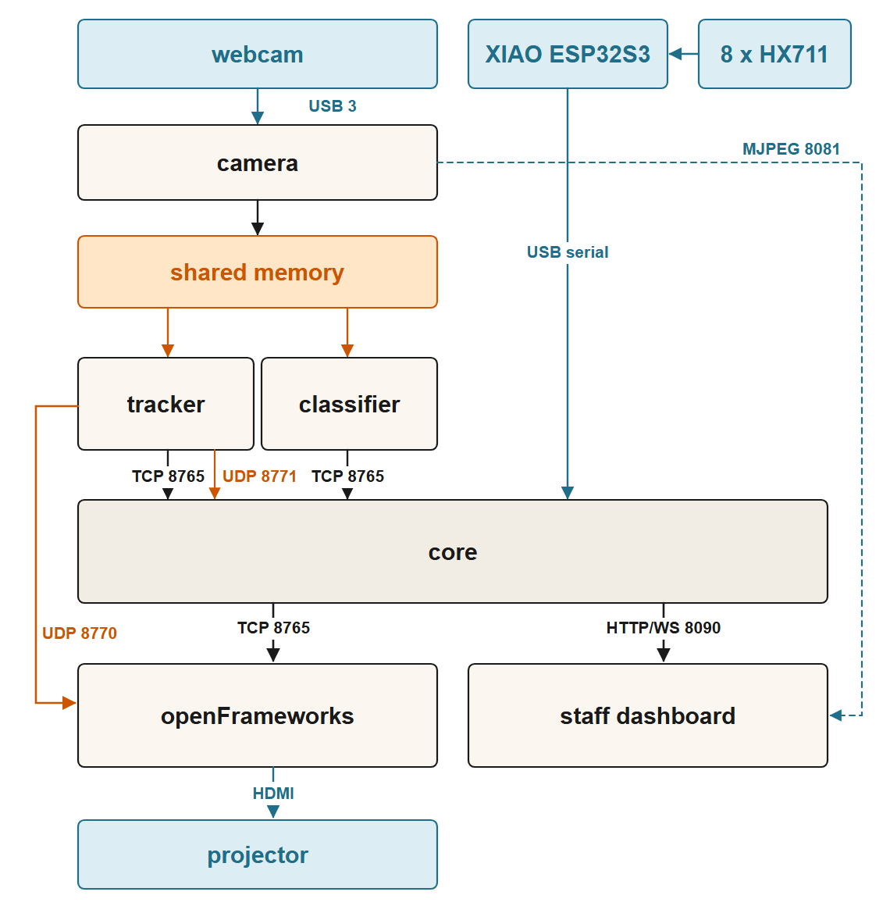

<p align="center">
  
</p>

<h1 align="center">The Firepot</h1>

<p align="center">
  A self-serve hotpot counter that weighs your bowl, prices it as you fill it, and sets itself on fire. Responsibly.
</p>

---

Eight ingredient bins are set into a tabletop of projector screen fabric. A
projector hangs above and lights the whole surface; a camera beside it watches
your hands. Every name, price, calorie count, tasting note, cart line and the
entire checkout is projected light landing on the table itself — right where a
person stands with a bowl in one hand and tongs in the other.

Each bin sits on a load cell. Take 60 g of dried eel and the cart on the near
edge of the table says so, priced, before you have put the tongs down. Tip some
back and the number falls. Pick a broth, pick a spice level, and a QR code
appears on the table for an itemised receipt on your own phone.

The whole interface is projected. There is no screen, no kiosk and nothing to
touch.

> **Build guide:** [`docs/HACKSTER.md`](docs/HACKSTER.md) is the full write-up —
> the story, the bill of materials, the wiring, the plywood cutting plan, and
> what the thing feels like to use.

---

## How it works

<p align="center">
  
</p>

Five processes, none of which shares a variable with any other. `python run.py`
starts and supervises all of them, waits for each to report ready, merges every
log into one stream, and restarts anything that dies. Every process reconnects
forever, so any of them can come and go while the table carries on.

| Process | What it owns |
| --- | --- |
| `core` | Every price, every rule and every word. The state machine, the cart, the load cells, the orders database, the staff dashboard. |
| `of` | The projected table. A dumb renderer — it draws what it is told and holds no opinion. |
| `camera` | Frame capture, exposure/white-balance control, the shared-memory frame ring, and an MJPEG stream for the dashboard. |
| `tracker` | MediaPipe hand tracking over a window that follows the hand, emitting one cursor in projector pixels. |
| `classifier` | Bin crops, dataset capture, and ingredient recognition. |

A sixth process, `voice`, is started alongside these but is still a stub — it
connects, heartbeats and does nothing else.

Three kinds of traffic get three kinds of transport, each chosen for how the
data goes stale:

- **Cursor packets** go over UDP and the reader drains the socket, keeps the
  newest and throws the rest away. A queued cursor is worse than a lost one —
  the hand visibly walks back through its own history.
- **Camera frames** are six megabytes each, thirty times a second, so they go
  through a shared-memory ring with a seqlock. `core` never imports that
  module at all; the process that handles money has no way to touch a pixel.
- **State and control** go over TCP JSONL, one message per line.

There is exactly one coordinate system on the wire — projector pixels,
1920×1080 — so no two processes can disagree about where a bin is.

Further reading: [`docs/HOTPOT_ARCHITECTURE_v3.md`](docs/HOTPOT_ARCHITECTURE_v3.md)
is the authoritative design document; [`docs/VISUAL_LAYER.md`](docs/VISUAL_LAYER.md)
covers the renderer.

## Hardware

- **8 ×** 1 kg load cells with HX711 amplifiers, one per bin
- **1 ×** Seeed Studio XIAO ESP32S3, streaming all eight channels over USB
- **1 ×** 1080p projector, mounted on the wall right against the ceiling and
  aimed straight down, covering the full 1524 mm width of the table; squared
  up with its own 4D keystone
- **1 ×** 1080p webcam, zip-tied to a batten off the projector's mount and
  looking down at the same table — it hangs upside down on this build
- **1 ×** mini PC host (developed against an ASUS NUC 14 running Windows 11)
- Plywood, projector screen fabric, and a kilogram of gold PLA

Printable parts (`.3mf` plates, ready to slice) are in
[`hardware/3d-printed/`](hardware/3d-printed/); the KiCad project for the
load-cell harness is in [`hardware/firepot-loadcells/`](hardware/firepot-loadcells/).
The bill of materials with links, the wiring, and the cutting plan are all in
[`docs/HACKSTER.md`](docs/HACKSTER.md).

## Repository layout

```
config/            system.json — ports, thresholds, device selection
data/              catalogue.json, menu.json, locales/{en,zh}.json
firmware/loadcells/  PlatformIO firmware for the XIAO
hardware/          3D-printable parts and the KiCad schematic
of/hotpot-table/   the openFrameworks app (the projected table)
python/hotpot/     core, camera, tracker, classifier, voice, common
python/tests/      the unit test suite
tools/             dataset export, diagram rendering, rig utilities
run.py             the launcher and supervisor
```

## Getting started

### 1. Put it inside an openFrameworks tree

The Visual Studio project walks five levels up to find openFrameworks, so this
repository has to live at `apps/myApps/hotpot-table`. Download
[openFrameworks 0.12.1](https://openframeworks.cc/download/), unzip it, and
clone into it:

```
cd openFrameworks/apps/myApps
git clone https://github.com/rahuljeyaraj/hotpot-table
```

### 2. Build the table

`ofxGui`, `ofxOsc` and `ofxNetwork` ship with openFrameworks.
[ofxFlowTools](https://github.com/moostrik/ofxFlowTools) — the fluid solver
behind the fire — is a separate download into `openFrameworks/addons/`, and it
needs a patch before it will build:

```
cd openFrameworks/addons/ofxFlowTools
git apply ../../apps/myApps/hotpot-table/of/patches/ofxFlowTools.patch
```

The patch replaces two constructs the current compiler rejects, and fixes a
density lookup in the buoyancy and diffusion shaders that samples a texture at
a different resolution from the one it renders at.

Then open `of/hotpot-table/hotpot-table.sln` and build the **Debug**
configuration — that is the binary the launcher starts. Set `HOTPOT_OF_BIN` to
run something else.

### 3. Install the Python side

One interpreter for the whole tree:

```
pip install -r python/requirements.txt
```

### 4. Flash the XIAO

```
cd firmware/loadcells
pio run -t upload
pio device monitor
```

A working board probes all eight cells and then streams `raw <c0> ... <c7>` at
115200 baud. If a cell is missing, the probe names the pin and says whether the
data line is floating (open wire or unpowered HX711) or driven high (check the
clock).

### 5. Point it at your own rig

Three values:

- `SCALE_PORT` in `python/hotpot/core/main.py` — the XIAO's serial port.
  `pio device monitor` names yours.
- `camera.windows_device_index` in `config/system.json` — which webcam.
- `of/hotpot-table/bin/data/display.txt` — the projector's desktop origin as
  `x,y`. Start the app once; it writes the file and logs every monitor it found
  with its origin, so you can fill in the right one.

## Running

```
python run.py
```

Everything starts, in order, with one merged log to the terminal and to
`logs/hotpot-<date>.log`.

| | |
| --- | --- |
| `python run.py --replace` | stop whatever is running, start fresh |
| `python run.py --stop` | stop a detached instance |
| `python run.py --only core,of` | start the table alone, camera unplugged |
| `python run.py --no-restart` | leave a crashed process dead so you can read its traceback |

The staff dashboard is at `http://<host>:8090` from any device on the same
network, phone included.

## The staff dashboard

A **Serving** switch at the top opens and closes the table. Turn it off and
nothing bills, so staff can reach across the bins and swap trays without
registering as a customer's pick. Every calibration control is refused while it
is on.

- **Bins** — eight cards with live weights, an ingredient dropdown each, restock
  alerts under 50 g, and the tare/calibrate controls. Taring runs on all eight
  bins from a single capture window.
- **Setup** — mark the four table corners on the live camera view, lay a grid
  over the flattened result to place the bins, then nudge a second grid with the
  arrow keys while watching the real projected light until it lines up. That
  last step is the only verification that can actually fail, and it has to be
  done by a human looking at the table.
- **Capture** — photograph the bins to build a training dataset, one burst at a
  time. Export with `tools/export_edgeimpulse.py`.
- **Developer** — hand skeleton overlay, classifier guesses, camera controls,
  per-process health, and a live plot of each load cell (raw against filtered)
  with the filter windows adjustable while you watch.

## Calibration

Turn **Serving** off first. Geometry, in the Setup tab, in card order: four
corners → camera bin grid → projector bin grid. Then scales, in the Bins tab:
empty every bin and tare all eight, then calibrate each one against a known
mass. A fit under ten counts per gram is refused — that means the cell has come
loose or the weight was too light. Finally set what each bin holds.

To check the table before any load cells exist, run
`python run.py --only core,of` and use the Developer tab's per-bin
**Pick** / **Put back** buttons, which drive the whole flow through to the
token number.

## Tests

```
python -m unittest discover -s python/tests
```

The suite runs with no camera, no projector and no XIAO attached — every module
that talks to hardware takes the open call as a parameter, so the arithmetic
that can silently mis-bill is testable on a bare machine.

## Documentation

| | |
| --- | --- |
| [`docs/HACKSTER.md`](docs/HACKSTER.md) | Build guide: story, BOM, wiring, cutting plan, assembly |
| [`docs/HOTPOT_ARCHITECTURE_v3.md`](docs/HOTPOT_ARCHITECTURE_v3.md) | The authoritative design document |
| [`docs/VISUAL_LAYER.md`](docs/VISUAL_LAYER.md) | Renderer spec: bins, halo, fire, cart |
| [`docs/ROBOFLOW_PATHWAY.md`](docs/ROBOFLOW_PATHWAY.md) | The second classifier training/deploy path |
| [`docs/INGREDIENT_SUBSTITUTES.md`](docs/INGREDIENT_SUBSTITUTES.md) | Which prop stands in for which ingredient, and why |

## License

MIT — see [LICENSE](LICENSE).
